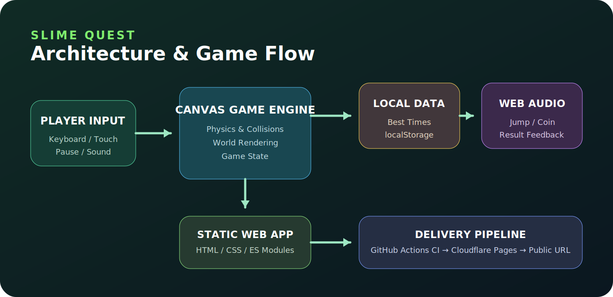
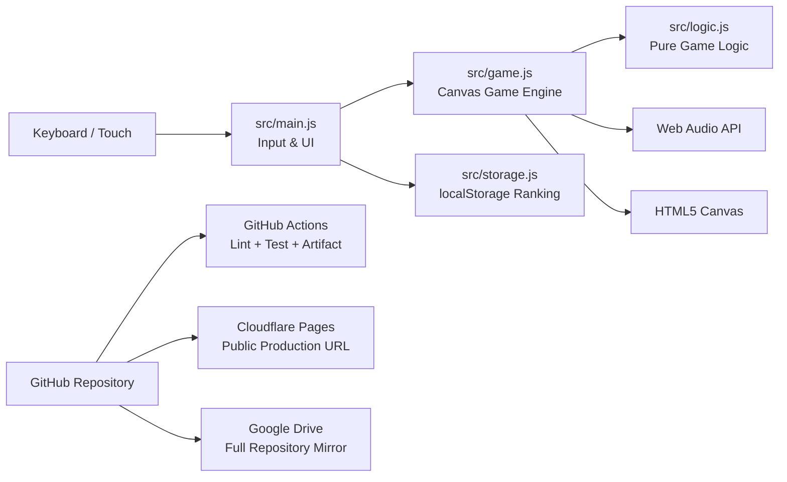

# Slime Quest

[🎮 本番環境で遊ぶ](https://slime-quest-web-game.pages.dev) · [⚙️ GitHub Actions](https://github.com/univcorp2-ctrl/slime-quest-web-game/actions) · [💻 Codespacesで開く](https://github.com/codespaces/new?hide_repo_select=true&ref=main&repo=1297141853)



ブラウザだけで遊べる、レスポンシブ対応の2Dアクションゲームです。青いスライムを操作し、コインをすべて集めて森の右端にあるクリスタルへ到達するとクリアです。

## 主な機能

- HTML5 Canvasによる横スクロールアクション
- キーボード・スマートフォンのタッチ操作対応
- コイン、敵、トゲ、落下、ライフ、ゴール判定
- Web Audio APIによる軽量な効果音とミュート
- `localStorage` によるベストタイム上位5件の保存
- レスポンシブUI、キーボードフォーカス、ARIAラベル
- Node.js標準テストランナーによるロジックテスト
- GitHub Actionsによるlint・test・配布用artifact作成
- Cloudflare Pagesへの本番公開
- Google Driveへのリポジトリ完全同期

## 遊び方

| 操作 | キーボード | スマートフォン |
|---|---|---|
| 左右移動 | `←` `→` または `A` `D` | 画面下の左右ボタン |
| ジャンプ | `Space` `↑` または `W` | 画面下の上ボタン |
| 一時停止 | `P` または画面右上 | 画面右上 |

全コインを集めるまではゴールがロックされています。敵やトゲに触れるか穴へ落ちるとライフを失います。

## ローカル実行

```bash
npm ci
npm run check
npm run serve
```

ブラウザで `http://localhost:8000` を開きます。GitHub Codespacesではポート8000が自動転送されます。

## アーキテクチャ



詳細は [`docs/architecture.md`](docs/architecture.md) を参照してください。

## ディレクトリ

```text
.
├── index.html                 # UIとCanvas
├── styles.css                 # レスポンシブデザイン
├── src/
│   ├── main.js                # DOM、入力、HUD、ランキング表示
│   ├── game.js                # 物理、描画、衝突、状態遷移
│   ├── logic.js               # テスト可能な純粋関数とステージ定義
│   └── storage.js             # localStorage永続化
├── tests/                     # Node.js標準テスト
├── scripts/lint.mjs           # 依存ゼロの静的チェック
├── docs/architecture.md       # 設計説明
└── .github/workflows/ci.yml   # CIとサイトartifact
```

## 本番運用に必要なもの

ゲーム本体に外部APIやSecretsは不要です。Cloudflare PagesのGit連携とGoogle Drive同期は連携Worker側で管理され、Secretsをブラウザへ公開しません。日常運用は `main` へのpushだけで、CI・Pages更新・Drive同期が実行されます。

## 開発コマンド

- `npm run lint`: 禁止パターンと改行を検査
- `npm test`: ゲームロジックとランキング保存をテスト
- `npm run check`: lintとtestを連続実行
- `npm run serve`: ポート8000で静的配信

## 拡張案

複数ステージ、ボス戦、オンラインランキング、PWAオフライン対応、ステージエディタ、ゲームパッド入力を追加できる構造です。
