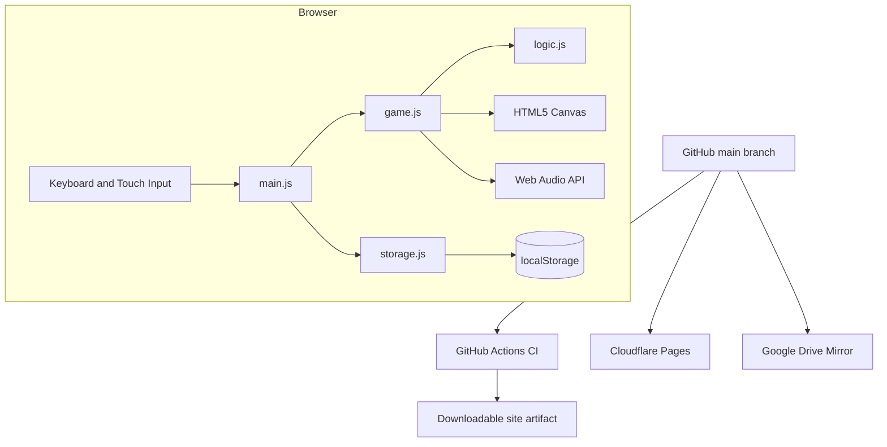

# Architecture

## 1. Overview

Slime Quest is a dependency-free static web application. The browser owns the complete runtime: input handling, physics, collision detection, rendering, audio, state management, and local ranking persistence. This keeps the production surface small and makes the game deployable to any static host.

## 2. Runtime flow

1. `index.html` creates the HUD, canvas, overlay, and touch controls.
2. `src/main.js` translates keyboard and pointer events into normalized controls.
3. `src/game.js` runs the animation frame loop, applies movement and gravity, resolves platform collisions, advances enemies, and renders the world.
4. `src/logic.js` supplies pure utilities and an immutable fresh level definition for each game.
5. `src/storage.js` validates, sorts, limits, and persists best times.
6. State changes update the overlay and HUD without a framework or server round-trip.

## 3. Data and security

No personal data is collected and no network request is required during gameplay. Best times remain in the player's browser under `slime-quest-ranking-v1`. There are no client-side Secrets. A user can reset records by clearing site storage.

## 4. CI/CD

The `CI` workflow runs on pushes, pull requests, and manual dispatch. It installs the lockfile, executes the zero-dependency linter, runs Node.js tests, and uploads the deployable site files as an artifact. Cloudflare Pages publishes the repository's root directory from `main`. The connected Worker mirrors the full repository into a repository-named Google Drive folder.

## 5. Failure boundaries

- Audio initialization may be blocked until user interaction; gameplay continues without sound.
- Corrupt ranking JSON is treated as an empty ranking.
- Animation delta is clamped to avoid a large physics jump after a suspended tab.
- Player damage includes a temporary invincibility window to prevent repeated life loss.

## 6. Extension points

- Move level definitions into `data/stages.js` to support stage selection.
- Add a service worker and manifest for offline PWA installation.
- Replace local ranking storage with a serverless API for shared leaderboards.
- Introduce sprite atlases without changing the engine-facing entity model.
- Add gamepad input by mapping it into the same `setControl` interface.
